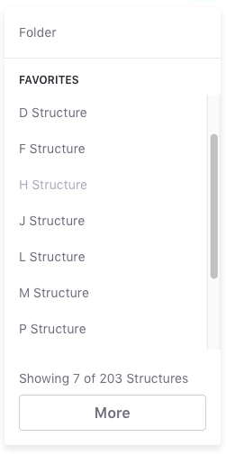

# Offer both low-level and high-level components that are exported from each package.

## Context

The primary issue we are facing right now is determining how "high-level" the component should be. For example, should we create a single component with many props, or should we create many components to be composed together.

This boils down to two main goals:

-   Provide enough flexibility and low-level components for teams to quickly build and deliver applications without being blocked by us
-   Provide quality high level components that allow teams to quickly build applications with the best possible interactions (UX) that are consistent, performant, accessible and extensible without the need of repeating themselves over and over again. These high-level components are composed of low-level components

```jsx
<ClayCard>
	<ClayCard.Title onClick={handleTitleClick}>
		<ClayIcon symbol="check" />

		{'Hello World'}
	</ClayCard.Title>

	<ClayCard.Body onClick={handleBodyClick}>
		<ClayCard.Description>
			{'Some cool descriptors'}
		</ClayCard.Description>
	</ClayCard.Body>
</ClayCard>

// vs
<ClayCard
	iconTitleLeftSymbol="check"
	onTitleClick={handleTitleClick}
	onBodyClick={handleBodyClick}
	description="foo bar baz"
	title="hello world"
/>
```

## Decision

The decision going forward is to create 2 sets of components

-   low-level composable components such as `<ClayCard.Header>`, `<ClayCard.Footer>`
-   simple high-level components that cover basic lexicon uses

### What does this look like?

#### Composable:


```jsx
<ClayDropDown>
	<ClayDropDown.Search
		onChange={() => {}}
		placeholder="Search"
		spritemap={spritemap}
		value={''}
	/>

	<ClayDropDown.ItemList>
		{items.map((item, i) => (
			<ClayDropDown.Item href={item.href} key={i}>
				{item.label}
			</ClayDropDown.Item>
		))}
	</ClayDropDown.ItemList>
</ClayDropDown>
```

Composing gives the user more control over the layout and interactions. Our "sell" here for the low-level components are for cases where users need to create other behaviors or customize their components in more detail.

#### High-level:



```jsx
<ClayDropDownWithPagination
	delta={delta}
	header="Favorites"
	items={items} // array of objects with `label` and `href`
	message={'Showing {0} of {1} Structures'}
	title="Folder"
/>

// Compare if this component was composed of low-level components
<ClayDropDown>
	<ClayDropDown.Header header="Folder" />

	<ClayDropDown.ItemList>
		<ClayDropDown.Group header="Favorites">
			{items.slice(0, page * delta).map((item, i) => (
				<ClayDropDown.Item href={item.href} key={i}>
					{item.label}
				</ClayDropDown.Item>
			))}
		</ClayDropDown.Group>
	</ClayDropDown.ItemList>

	<ClayDropDown.Caption>
		{`Showing ${page * delta} of ${items.length} structures`}
	</ClayDropDown.Caption>

	<ClayDropDown.Action onClick={() => setPage(page + 1)}>
		{'Show More'}
	</ClayDropDown.Action>
</ClayDropDown>
```

You'll notice that the high-level component handles much of the interactions internally. It will handle the click of the `show more`, paginate, and update language as necessary. In fact, even this high-level component will be made from the smaller low-level building blocks.

Finally, both the high-level and low-level components will be exported from each package. The low-level component will be exported as default, but the high-level ones will be exported by name. The high-level components should be descriptive in name, following the pattern of `{ComponentName}{Variant}`.

For example:

```jsx
export {ClayDropDownWithPagination};

export default ClayDropDown;
```

The purpose of this would be to expose descriptive high-level components as well as the basic building blocks of the component as the default export.

## Consequences

Benefits:

-   Gives users high-level components to import and use right away.
-   Gives users low-level components to build more complex interactions.
-   Gives maintainers leverage by encouraging users to build their own custom components built on our building blocks rather than baking it into one of our high-level versions.
-   Increased consistency for high-level components usage
-   Reduced support costs (less versions of the same thing)

Drawbacks:

-   More lines of code to maintain.
-   Increased API surface area, with corresponding requirement to maintain backwards compatibility.
-   Risk of exposing implementation details as low-level API.
-   Possible lock-in scenarios when using high-level components. Teams might need to move from a high-level component to a composition scenario in case they need to add something not already covered.
-   Increased uncertainty... what approach should a developer use and when?
